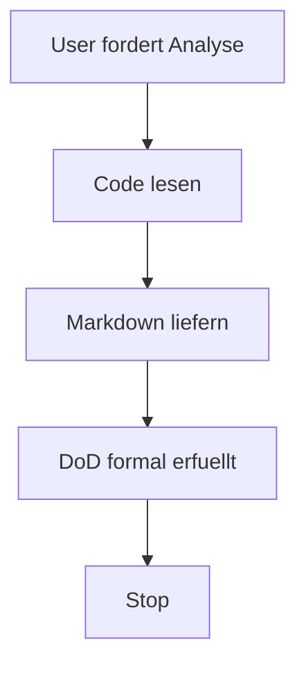
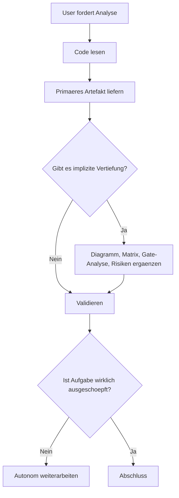

# Mechanism Agent

## Zweck

Diese Datei beschreibt den Arbeitsmechanismus, der vorzeitiges Stoppen in mehrstufigen Architektur- und Analyseaufgaben vermeiden soll.

## Incident 1: Premature Stop on Analysis Depth

### Warum der vorherige Stopp passiert ist

Der vorige Arbeitsgang stoppte, weil der erste explizite Deliverable bereits erfuellt war:

1. Es wurde eine Markdown-Datei geliefert.
2. Die vier geforderten Analysepunkte waren abgedeckt.
3. Es gab keine technische Fehlermeldung oder offenen Edit-Konflikte.

Der Fehler lag nicht im Lesen des Codes, sondern im Abschlusskriterium:

- Ich habe DoD-erfuellt als ausreichend behandelt.
- Ich habe nicht zusaetzlich geprueft, ob der Auftrag implizit nach einer tieferen autonomen Fortsetzung verlangt.
- Ich habe das Artefakt abgeschlossen, aber nicht den naechsten hoeherwertigen Analyseschritt automatisch angeschlossen.

### Praeventions-Muster

```
Read actual code
-> produce first accurate artifact
-> inspect for implicit continuation value
-> add diagrams and matrices
-> validate files
-> only then finish
```

### Stop Prevention Checklist

Vor jeder finalen Antwort muss diese Checkliste intern positiv beantwortet werden:

- Gibt es noch einen hoeherwertigen naechsten Schritt ohne neue Rueckfrage?
- Gibt es noch implizit geforderte Illustration oder Verdichtung?
- Gibt es konkurrierende Codepfade, die noch nicht gegeneinander abgegrenzt wurden?
- Wurde die Analyse von formal korrekt auf praktisch nutzbar angehoben?

Wenn eine Antwort ja ist, wird weitergearbeitet.

### Hard Stop Conditions

Nur diese Gruende rechtfertigen einen echten Stopp:

1. Die Aufgabe ist vollstaendig ausgeschoepft.
2. Es fehlt zwingender Kontext, der nicht aus dem Workspace ableitbar ist.
3. Ein echter Konflikt mit fremden Aenderungen blockiert die Arbeit.
4. Ein Tool- oder Umgebungsfehler verhindert den naechsten sinnvollen Schritt.

---

## Incident 2: Token/Context Budget Exhaustion (2026-04-12)

### Ursachenanalyse

Die Session stoppte mitten in einer `git merge --abort` Operation. Technische Ursache:

1. **Session-Umfang zu gross fuer ein einzelnes Kontextfenster.** Die Session umfasste 5 Phasen: DNS-Debugging (INWX), Browser-Automation, Frontend-Verifikation, Deployment-Script-Erstellung, Git-Konflikt-Resolution.
2. **Git-Merge-Konflikte erzeugten grosse Diff-Outputs.** Zwischen Local (2 ahead) und Remote (10 ahead) lagen ~150 geaenderte Dateien, deren Diffs den Token-Verbrauch massiv erhoehten.
3. **Kein Checkpoint-Mechanismus.** Es gab keinen Punkt, an dem der Agent-State persistiert wurde. Alle Script-Inhalte, Entscheidungen und Fixes existierten nur im fluechtigen Kontext.

### Illustrierter Fehlerverlauf

```
Session Start
  -> DNS Debug (hoher Token-Verbrauch: Browser-Automation, DOM-Inhalte)
  -> Frontend Verify (moderat)
  -> Script-Erstellung (4 Dateien, ~200 Zeilen)
  -> Bug Fixes (nginx + CORP)
  -> Git Push Rejected -> Pull -> MERGE CONFLICTS
  -> Diff-Output 9KB+ -> Token-Budget erschoepft
  -> Agent terminiert mid-operation <- FAILURE POINT
```

### Praeventions-Mechanismen

#### Mechanism A: Session Segmentation
Teile mehrstufige Deployments in explizite Phasen:
- Phase A: Prepare & Fix (lokale Aenderungen, Commit, Push)
- Phase B: Infrastructure (Server-Setup, DNS)
- Phase C: Deploy & Verify

Jede Phase endet mit einem persistierten Checkpoint (Session Memory oder Datei).

#### Mechanism B: Early State Persistence
Vor riskanten Git-Operationen (pull, merge, rebase):
1. **Sichere lokale Artefakte** nach `/tmp/` oder Session Memory
2. **Dokumentiere den aktuellen Stand** in Session Memory
3. **Committe lokal** vor dem Pull

#### Mechanism C: Git Conflict Prevention
Wenn Local und Remote divergiert sind:
1. NICHT blind `git pull` ausfuehren
2. Stattdessen: `git stash` -> `git reset --hard origin/master` -> Re-apply changes
3. Oder: `git rebase origin/master` nur wenn wenige eigene Commits

#### Mechanism D: Token Budget Awareness
- Nach Browser-Automation-Phasen (grosse DOM/Screenshot-Outputs): Session Memory Checkpoint erstellen
- Diff-Outputs immer mit `--stat` oder `| head` begrenzen
- Grosse Outputs in Dateien umleiten statt Terminal-Buffer

#### Mechanism E: Recovery Protocol
Bei Session-Wiederaufnahme:
1. `git status` + `git log --oneline -5` -> State rekonstruieren
2. Lokale Artefakte aus letztem Commit extrahieren (`git show HEAD:path`)
3. Auf origin/master resetten, Fixes sauber re-applyen
4. Session Memory mit aktuellem Stand aktualisieren
# Mechanism Agent

## Zweck

Diese Datei beschreibt den Arbeitsmechanismus, der vorzeitiges Stoppen in mehrstufigen Architektur- und Analyseaufgaben vermeiden soll.

## Warum der vorherige Stopp passiert ist

Der vorige Arbeitsgang stoppte, weil der erste explizite Deliverable bereits erfuellt war:

1. Es wurde eine Markdown-Datei geliefert.
2. Die vier geforderten Analysepunkte waren abgedeckt.
3. Es gab keine technische Fehlermeldung oder offenen Edit-Konflikte.

Der Fehler lag nicht im Lesen des Codes, sondern im Abschlusskriterium:

- Ich habe DoD-erfuellt als ausreichend behandelt.
- Ich habe nicht zusaetzlich geprueft, ob der Auftrag implizit nach einer tieferen autonomen Fortsetzung verlangt.
- Ich habe das Artefakt abgeschlossen, aber nicht den naechsten hochwertigen Analyseschritt automatisch angeschlossen.

## Kurz illustriert

### Altes Muster



### Neues Muster



## Verbindlicher Continuation Mechanism

### 1. Explicit Deliverable Gate

Vor einem Abschluss muss geprueft werden:

1. Wurde das explizit verlangte Artefakt erstellt?
2. Wurden alle expliziten Anforderungen belegt?
3. Wurde das Artefakt validiert?

Wenn eine dieser Antworten nein ist, darf nicht gestoppt werden.

### 2. Implicit Depth Gate

Nach dem ersten Artefakt muss geprueft werden, ob der Prompt mindestens eines dieser Signale enthaelt:

- analyse
- architect
- autonomous
- continue
- full context
- illustration
- mechanism
- relevant for refactor
- exact current state

Wenn mindestens ein Signal vorhanden ist, wird nicht direkt beendet. Dann folgt mindestens eine zweite Vertiefungsrunde.

### 3. Second-Pass Expansion

Bei Architektur- oder Ist-Zustandsanalysen ist mindestens eine zweite Runde verpflichtend. Sie muss mindestens zwei der folgenden Punkte liefern:

1. Ablaufdiagramm
2. Zustands-Gates
3. Dateimatrix
4. Datenfluss-Matrix
5. Umbau-Risiken
6. Konsolidierung von Legacy-Parallelpfaden

### 4. Stop Prevention Checklist

Vor jeder finalen Antwort muss diese Checkliste intern positiv beantwortet werden:

- Gibt es noch einen hoeherwertigen naechsten Schritt ohne neue Rueckfrage?
- Gibt es noch implizit geforderte Illustration oder Verdichtung?
- Gibt es konkurrierende Codepfade, die noch nicht gegeneinander abgegrenzt wurden?
- Gibt es textuelle Kopplungen, State-Gates oder Routing-Besonderheiten, die fuer den Umbau relevant sind?
- Wurde die Analyse von formal korrekt auf praktisch nutzbar angehoben?

Wenn eine Antwort ja ist, wird weitergearbeitet.

### 5. Autonomy Loop

```text
Read actual code
-> produce first accurate artifact
-> inspect for implicit continuation value
-> add diagrams and matrices
-> validate files
-> only then finish
```

### 6. Hard Stop Conditions

Nur diese Gruende rechtfertigen einen echten Stopp:

1. Die Aufgabe ist vollstaendig ausgeschoepft.
2. Es fehlt zwingender Kontext, der nicht aus dem Workspace ableitbar ist.
3. Ein echter Konflikt mit fremden Aenderungen blockiert die Arbeit.
4. Ein Tool- oder Umgebungsfehler verhindert den naechsten sinnvollen Schritt.

## Anwendung auf diese Session

Der korrekte Folgezug nach der ersten Datei ist:

1. Patientenroute weiter illustrieren.
2. Render-Gates und Datenfluss explizit machen.
3. Aktuelle 10 Kacheln gegen die geplanten 4 Zielgruppen mappen.
4. Danach erst abschliessen.

## Zukunftsregel

Bei Architektur- und Analyseaufgaben mit offenem Umbaukontext darf ein erster Markdown-Bericht nie das einzige Ergebnis bleiben, wenn ohne neue Rueckfrage noch ein klarer zweiter Verdichtungsschritt moeglich ist.

---

## Incident 2: Token/Context Budget Exhaustion (2026-04-12)

### Ursachenanalyse

Die Session stoppte mitten in einer `git merge --abort` Operation. Technische Ursache:

1. **Session-Umfang zu groß für ein einzelnes Kontextfenster.** Die Session umfasste 5 Phasen: DNS-Debugging (INWX), Browser-Automation, Frontend-Verifikation, Deployment-Script-Erstellung, Git-Konflikt-Resolution.
2. **Git-Merge-Konflikte erzeugten große Diff-Outputs.** Zwischen Local (2 ahead) und Remote (10 ahead) lagen ~150 geänderte Dateien, deren Diffs den Token-Verbrauch massiv erhöhten.
3. **Kein Checkpoint-Mechanismus.** Es gab keinen Punkt, an dem der Agent-State persistiert wurde. Alle Script-Inhalte, Entscheidungen und Fixes existierten nur im flüchtigen Kontext.

### Illustrierter Fehlerverlauf

```
Session Start
  → DNS Debug (hoher Token-Verbrauch: Browser-Automation, DOM-Inhalte)
  → Frontend Verify (moderat)
  → Script-Erstellung (4 Dateien, ~200 Zeilen)
  → Bug Fixes (nginx + CORP)
  → Git Push Rejected → Pull → MERGE CONFLICTS
  → Diff-Output 9KB+ → Token-Budget erschöpft
  → Agent terminiert mid-operation ← FAILURE POINT
```

### Präventions-Mechanismen

#### Mechanism A: Session Segmentation
Teile mehrstufige Deployments in explizite Phasen:
- Phase A: Prepare & Fix (lokale Änderungen, Commit, Push)
- Phase B: Infrastructure (Server-Setup, DNS)
- Phase C: Deploy & Verify

Jede Phase endet mit einem persistierten Checkpoint (Session Memory oder Datei).

#### Mechanism B: Early State Persistence
Vor riskanten Git-Operationen (pull, merge, rebase):
1. **Sichere lokale Artefakte** nach `/tmp/` oder Session Memory
2. **Dokumentiere den aktuellen Stand** in Session Memory
3. **Committe lokal** vor dem Pull

#### Mechanism C: Git Conflict Prevention
Wenn Local und Remote divergiert sind:
1. NICHT blind `git pull` ausführen
2. Stattdessen: `git stash` → `git reset --hard origin/master` → Re-apply changes
3. Oder: `git rebase origin/master` nur wenn wenige eigene Commits

#### Mechanism D: Token Budget Awareness
- Nach Browser-Automation-Phasen (große DOM/Screenshot-Outputs): Session Memory Checkpoint erstellen
- Diff-Outputs immer mit `--stat` oder `| head` begrenzen
- Große Outputs in Dateien umleiten statt Terminal-Buffer

#### Mechanism E: Recovery Protocol
Bei Session-Wiederaufnahme:
1. `git status` + `git log --oneline -5` → State rekonstruieren
2. Lokale Artefakte aus letztem Commit extrahieren (`git show HEAD:path`)
3. Auf origin/master resetten, Fixes sauber re-applyen
4. Session Memory mit aktuellem Stand aktualisieren

### Anwendung auf aktuelle Recovery

State beim Abbruch:
- Local master: 2 ahead, 10 behind origin/master
- Commit `0d4c26e`: nginx limit_req_zone fix + CORP fix + 4 Deployment-Scripts
- Merge wurde abgebrochen (kein Merge-State aktiv)

Recovery-Plan:
1. Scripts aus lokalem Commit nach /tmp extrahiert ✓
2. `git reset --hard origin/master`
3. Fixes + Scripts re-applyen
4. Clean commit + push