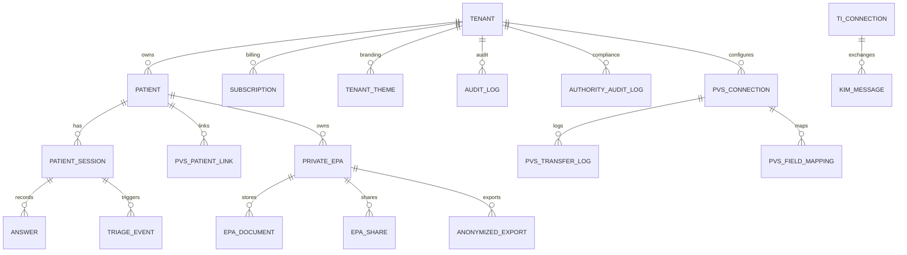

# Backend 3-Domain Architektur (Vorbereitung)

## Zielbild

Diese Vorbereitung trennt die Plattform in **3 Backend-Domänen** mit separaten Datenbanken:

1. **practice** – lokale Praxisprozesse (Patientenaufnahme, Behandlung, Queue)
2. **company** – internes Unternehmenssystem (Admin, Abrechnung, Konfiguration)
3. **authority** – Behörden-/Export-Domäne (PVS, TI, ePA, Compliance-Exports)

Die Trennung ist im Code über `BACKEND_PROFILE` und domänenspezifische DB-Clients vorbereitet.

---

## Technische Schalter

- `BACKEND_PROFILE=monolith|practice|company|authority`
- `ROUTE_DOMAIN_ISOLATION=true|false`
- `STRICT_DOMAIN_DB_ROUTING=true|false`
- `DATABASE_URL_PRACTICE`
- `DATABASE_URL_COMPANY`
- `DATABASE_URL_AUTHORITY`

**Kompatibilität:**

- `monolith` + `ROUTE_DOMAIN_ISOLATION=false` + `STRICT_DOMAIN_DB_ROUTING=false` verhält sich wie bisher.
- Bei aktivierter Isolation werden nur domäneneigene API-Routen gemountet (plus `shared`).

---

## Route Ownership (aktuelle Zuordnung)

| Domain | Routen (Auszug) |
| --- | --- |
| `practice` | `/api/sessions`, `/api/answers`, `/api/atoms`, `/api/patients`, `/api/queue`, `/api/therapy`, `/api/forms`, `/api/wearables`, `/api/ai` |
| `company` | `/api/admin`, `/api/content`, `/api/roi`, `/api/system`, `/api/payment`, `/api/subscriptions`, `/api/billing`, `/api/usage`, `/api/agents` |
| `authority` | `/api/export`, `/api/pvs`, `/api/ti`, `/api/epa` |
| `shared` | `/api/arzt`, `/api/mfa` |

> Hinweis: `shared` ist bewusst für Übergangsphasen enthalten. In einer strikten Zielarchitektur kann Auth als eigenes Identity-Backend ausgelagert werden.

---

## Identity-/Relation-Design für Filter & Tabellen

### Harte Filter-Regeln

1. **Tenant-Grenze immer zuerst**: `tenantId` oder `praxisId` ist Pflichtfilter.
2. **Patientenbezug**: nach Tenant-Filter nur über `patientId` auflösen.
3. **Sitzungsbezug**: medizinische Antworten/Triage nur über `sessionId` innerhalb desselben Tenants.
4. **Authority-Export**: Exporttabellen nur aus scope-validierten Sessions/Patients erzeugen.
5. **Audit-Spur**: jede Export-/Behördenaktion in Audit-Log erfassen.

### Kanonische Schlüssel

| Schlüssel | Bedeutung | Verwendung |
| --- | --- | --- |
| `tenantId` / `praxisId` | Mandanten-/Praxisgrenze | Primärer Sicherheitsfilter |
| `patientId` | Patientenidentität pro Tenant | Join zwischen Patient, Session, ePA |
| `sessionId` | Anamnese-/Behandlungssitzung | Join zwischen Session, Answer, Triage, Export |
| `connectionId` | PVS-Verbindung | Join zwischen PVS-Config, Mapping, Transfer-Logs |

---

## Mermaid ER (Domänenorientiert)

---

## Hetzner Rollout-Prep

1. Drei App-Instanzen mit je eigenem `BACKEND_PROFILE` starten.
2. Pro Instanz nur die zugehörige DB-URL setzen.
3. `ROUTE_DOMAIN_ISOLATION=true` aktivieren.
4. Ingress/Reverse-Proxy pro Subdomain routen:
   - `practice.<domain>` -> practice backend
   - `core.<domain>` -> company backend
   - `authority.<domain>` -> authority backend
5. Separate Backups pro Domain-DB planen (RPO/RTO getrennt messbar).

Für lokales/probeweises Deployment ist `docker-compose.tri-backend.yml` vorbereitet.
